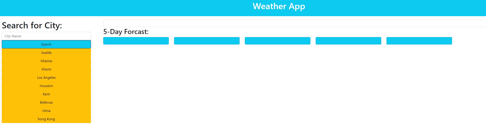
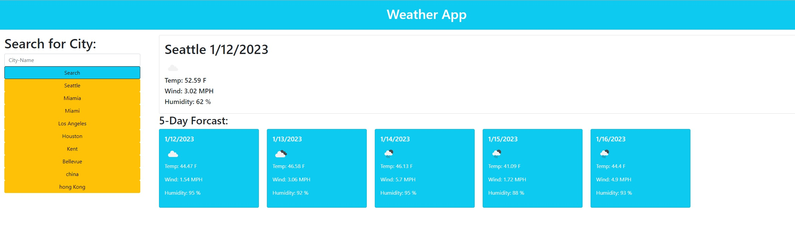

# Weather-Application-Challenge

## Description
This is a Weather Application that searches for City Input and display the 6 Day Forcast. Top screen will display the present and the bottom 5 will display the 5 day forcast. Previous search city will also be displayed where user can just click on to pull the city back up.

In this challenge, we demonstrated our knowledge in bootstrap, fetching api and use the api data.

## Usage
The use of this website is to find the upcoming weather forcast for a city

## Features
Search input on left screen that allow user to type in a city name
Previous Search history button that user can click on to bring up past city weather

